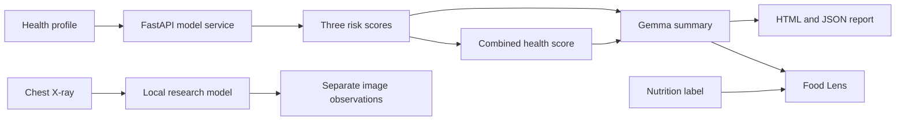

<p align="center">
  
</p>

<h1 align="center">Vitalis</h1>

<p align="center">
  <strong>A little context. A clearer picture.</strong><br />
  AI-assisted health insights, nutrition-label guidance, and research medical imaging in one private workspace.
</p>

<p align="center">
  
  
  
  
  
</p>


> [!IMPORTANT]
> Vitalis is an educational hackathon prototype—not a medical device. Its scores and generated content are not diagnoses and must not replace advice from a qualified healthcare professional.

## Why Vitalis?

Health data often lives in disconnected forms: lab values, lifestyle details, food labels, and medical images. Vitalis brings those signals into a single, understandable workflow while keeping each model's output transparent and appropriately scoped.

- **One connected assessment** — combines heart disease, diabetes, and overweight/obesity risk estimates into a clear health overview.
- **Plain-language context** — uses Gemma to explain the assessment and suggest practical next steps.
- **Food Lens** — extracts visible nutrition-label facts before generating personalized guidance from the completed health report.
- **Research X-ray view** — presents local chest-X-ray model observations separately from the tabular health score.
- **Portable reports** — exports the complete session as human-readable HTML or structured JSON.
- **Privacy-minded sessions** — stores structured results in browser `localStorage`; uploaded image bytes are not persisted there.

## Product tour

| Health profile | Your insights | Medical imaging | Food Lens |
| --- | --- | --- | --- |
| Capture clinical and lifestyle inputs expected by the three models. | Review individual risk estimates, a combined score, and a Gemma summary. | Add a de-identified chest X-ray for research-only observations. | Turn a nutrition label into extracted facts and health-aware guidance. |

## How it works



The tabular service returns heart disease, diabetes, and overweight/obesity scores on a `0–100` scale. Vitalis calculates the summary indicator as:

```text
health score = 100 − mean(heart risk, diabetes risk, obesity risk)
```

Diabetes and heart disease use positive-class probability. Obesity risk combines the trained model's overweight and obesity classes. The result is a product-level summary indicator, not a validated clinical probability.

## Tech stack

- **Web:** Next.js 16, React 19, TypeScript, Tailwind CSS, Recharts, Motion, and GSAP
- **API layer:** Next route handlers for assessment, summary, food analysis, and imaging
- **Model service:** FastAPI, pandas, scikit-learn/joblib, Pillow, PyTorch, and TorchXRayVision
- **Generative AI:** Gemma through the Gemini API
- **Local runtime:** Vinext, Vite, and Wrangler

## Getting started

### Prerequisites

- Node.js `22.13.0` or newer
- Python 3 with `venv`
- A Gemini API key
- The compressed diabetes model included at `models/diabetes_random_forest.joblib`

All three tabular model artifacts are included in the repository. The diabetes pipeline is stored with lossless Joblib/XZ compression, reducing it from roughly 185 MB to 21 MB without changing its predictions. The original uncompressed local file remains ignored.

### 1. Install dependencies

```bash
git clone https://github.com/mallurivikas/Hacktoberfest26.git
cd Hacktoberfest26
npm install

python3 -m venv .venv
.venv/bin/pip install -r models/requirements-xray.txt
```

### 2. Configure the environment

```bash
cp .env.example .env
```

Set your server-side Gemini credential in `.env`:

```dotenv
GEMINI_API_KEY=your_api_key_here
```

The checked-in defaults connect the web app to the local model service at `127.0.0.1:8000`. You can override `MODEL_API_URL`, `XRAY_API_URL`, or `GEMMA_FAST_MODEL` when needed. Never expose credentials in client-side code or commit your `.env` file.

### 3. Start both services

Terminal one—the local model service:

```bash
.venv/bin/uvicorn models.server:app --host 127.0.0.1 --port 8000
```

Terminal two—the web application:

```bash
npm run dev
```

Open the local URL shown in the terminal. For a quick tour, choose **Explore with sample data**; sample scores are illustrative and do not invoke the prediction models.

> [!NOTE]
> TorchXRayVision downloads and caches the approximately 28 MB `densenet121-res224-all` checkpoint the first time an X-ray is analyzed.

For a lightweight tabular-model deployment, use `models/requirements.txt`. The
X-ray dependencies are intentionally isolated in `models/requirements-xray.txt`
because PyTorch is too large for the standard Vercel function bundle.

The deployable imaging service lives in `xray-api/`. It uses an ONNX export of
the same trained DenseNet checkpoint so CPU deployments do not need to bundle
PyTorch. Deploy it as a separate Vercel project with that directory as the
project root. Its public `/xray` endpoint should be used as the frontend's
`XRAY_API_URL`.

### Research imaging services

The medical branch is intentionally split into independent services so the UX
client can call only the modality it needs. Each accepts an optional
`health_model_summary` JSON field from the tabular-model branch as display
context; it never changes image-model scores.

| Service | Run port | Endpoint | Scope |
| --- | --- | --- | --- |
| `medical-image-analysis` | `8002` | `POST /api/v1/medical/scan/analyze` | Chest X-ray pathology scoring |
| `brain-mri-analysis` | `8003` | `POST /api/v1/medical/mri/analyze` | 2D brain MRI four-class demo |
| `brain-ct-analysis` | `8004` | `POST /api/v1/medical/ct/analyze` | Single-slice brain CT haemorrhage screening |

For the CT service, use `brain-ct-analysis/README.md`. It accepts JPG, PNG,
and WEBP images plus single-frame DICOM files, but deliberately rejects CT
volumes. Its compact ResNet-18 checkpoint is only intended for the documented
2D brain-CT research demo, so callers must submit an axial brain CT slice.

## API overview

| Route | Purpose |
| --- | --- |
| `POST /api/assess` | Sends a completed profile to the three risk models and returns scores, BMI, and the combined indicator. |
| `POST /api/summary` | Turns a profile and assessment into a concise Gemma health summary. |
| `POST /api/food/extract` | Extracts only visible, validated nutrition facts from a label image. |
| `POST /api/food/recommend` | Combines extracted label facts with the complete health report for personalized guidance. |
| `POST /api/scan` | Sends a chest-X-ray image and separate health context to the research imaging service. |

Image requests use `{ name, mimeType, data }`, where `data` is a base64 data URL. The UI accepts JPG, PNG, and WebP images up to 5 MB.

The Python service exposes:

| Endpoint | Purpose |
| --- | --- |
| `GET /health` | Confirms that the local service and its three tabular models are available. |
| `POST /predict` | Returns `{ scores: { obesity, diabetes, heart_disease }, bmi }`. |
| `POST /xray` | Returns research-only observations from a de-identified chest X-ray. |

## Food Lens pipeline

Food analysis deliberately runs in two stages:

1. Gemma extracts only what is visible on the uploaded label, including nutrients, ingredients, allergens, missing fields, and confidence.
2. Vitalis normalizes the response, then combines those facts with the complete JSON health report to generate a `Yes`, `Occasionally`, `No`, or `Unknown` recommendation, portion guidance, benefits, and watchouts.

The displayed food-fit score is an explanatory product indicator—not a medical probability.

## Reports and local session data

Vitalis exports:

- an HTML report that can be printed or saved as PDF; and
- a JSON report containing the profile, BMI, assessment, AI summary, food analysis, and medical-image analysis.

Structured session data is stored under `vitalis-session-report` in browser `localStorage`, allowing Food Lens to reuse health context after a refresh. Uploaded image bytes are not included in that stored record.

## Safety and privacy

- Remove names, IDs, and other personal identifiers before uploading any medical image.
- Uploaded images are sent for analysis only after the user selects **Analyze**.
- Raw X-ray outputs remain separate from the three-model combined health score.
- Server errors expose a request ID for troubleshooting without returning credentials.
- Keep Gemini and model-service credentials server-side.

## Useful commands

```bash
npm run dev      # start the local web app
npm run build    # create a production build
npm run start    # run the built app locally with Wrangler
npm run lint     # run ESLint
```

## Project references

- [Hacktoberfest26 repository](https://github.com/mallurivikas/Hacktoberfest26)
- [Gemma 4 challenge](https://github.com/reacthyderabad/hacktoberfest-hack-day-2026/blob/main/challenges/gemma-4.md)
- [Gemini API reference](https://ai.google.dev/api/generate-content)

---

<p align="center">Built for Hacktoberfest Hack Day 2026 with a focus on clarity, context, and responsible health communication.</p>
